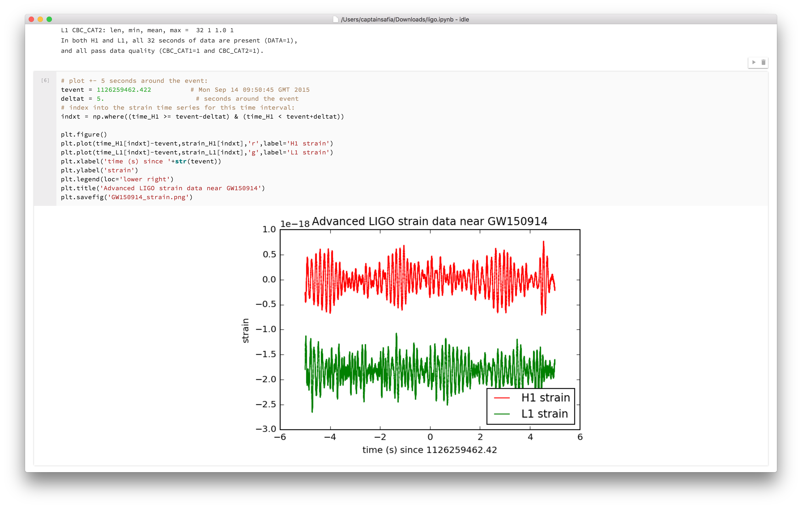
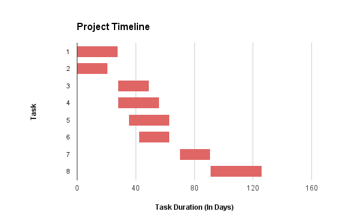

**Digital Science Catalyst Grant Application**

nteract | June 2016

##### Overview

nteract (NOTE:  nteract, 2016 (https://nteract.io/)) is an open-source, desktop-based application for writing and reading interactive "notebook" documents that contain executable blocks of code, prose, plots and images. It is used by data scientists, researchers, and developers to create and share interactive documents describing their work with colleagues and the general public. The product has been in development since May 2015 and is currently in the alpha stage. This grant will help cover the cost of hiring one software engineer, with domain expertise, to develop a feature for the nteract application for interfacing with remote kernels.

##### The Product

nteract is an interactive computing environment packaged as a desktop application. Users can use this application to create "notebook" documents which include executable blocks of code, prose, plots, and images. 

| Figure 1 | 
------------
|  |
| An interactive notebook, viewed in the nteract desktop application, released by the Laser Interferometer Gravitational-Wave Observatory showcasing the signal processing code used in the discovery of gravitational waves. This figure shows an executable code cell and the resulting data visualization. |

##### Open Source

nteract is open source and licensed under the Mozilla Public License v2. The nteract project takes contributions from a variety of individuals and follows the C4.1, or the Collective Code Construction Contract, contribution guidelines which decrease the barrier to contributing and accelerate the pace of development. This ensures that the project is always invigorated with new contributions and perspectives from diverse contributors.

##### Technical Details

The nteract desktop application is written in JavaScript, a popular and easy-to-learn web programming language and packaged using Electron (NOTE:  GitHub, 2016 (https://electronjs.org/)), a framework for creating cross-platform desktop applications built on HTML, CSS, and JavaScript.  The desktop front-end uses nteract’s commutable (NOTE:  nteract, 2016 (https://github.com/nteract/commutable)) API to interface with a notebook document, represented as a JSON file (NOTE:  JSON, 2015 (https://www.json.org/)). The front-end also uses nteract’s enchannel (NOTE:  nteract, 2016 (https://github.com/nteract/enchannel)) APIs to communicate with a kernel, a backend that is responsible for executing code and sending back responses. The enchannel API manages this communication using the existing Jupyter Messaging Protocol (NOTE:  Project Jupyter, 2016 (https://jupyter-client.readthedocs.io/en/latest/messaging.html)), a messaging specification for communicating between a front-end and a kernel.

| Figure 2 |
------------
|  |
| Figure 2. A diagram of the nteract desktop application architecture. |

###### Use Cases

nteract can be used in a variety of different contexts across scientific research, data science, and scientific education. These contexts include:

* **Data Science and Research:** Data science is a growing field with a strong emphasis on collaboration and storytelling. Interactive notebook documents are the perfect way for data scientists and researchers to share their process and insights in a reproducible way. nteract makes working with these documents as intuitive and natural as working with a Word document.

* **Education:** Interactive notebook documents that explain scientific, mathematical, and computational concepts can be written in nteract and shared with students. These notebook documents are engaging and effortless to share, with a tool like nteract, and make learning an enjoyable process for students.

##### Previous Funding

nteract has previously received funding from two private companies, Plotly (NOTE:  Plotly, 2016 (https://plot.ly/)) and Domino Data Lab (NOTE:  Domino Data Lab, 2016 (https://www.dominodatalab.com/)) for work on the product. The funding has been allocated towards the development of the beta version of the application.

##### The Benefits

nteract improves communication within scientific teams, between scientific teams, and between scientists and the general public. 

As computers have proliferated science, researchers increasingly rely on computer code to analyze data and discover meaningful results. Using nteract, scientists can create interactive documents that elaborate on their process, showcase their research code, and feature data visualizations related to their work. These documents can be shared amongst scientists for peer review or knowledge sharing.

In the United States, about 2% of federal taxes are allocated towards scientific and medical research (NOTE:  Center on Budget and Policy Priorities, 2016 (http://www.cbpp.org/research/federal-budget/policy-basics-where-do-our-federal-tax-dollars-go)), but is the public aware of the discoveries that are made on their tax dollars? Interactive notebooks and nteract make it easy for researchers to share their work in an understandable and approachable format with the general public, breaking down the knowledge gap between citizens and researchers.

Finally, the enchannel and commutable APIs mentioned above, and several others, are open-source and well-documented, meaning that other developers can use these APIs to develop their own innovative interactive computing applications. 

##### Competitor Information

Similar products in the interactive notebook-based computing space include Jupyter Notebook (NOTE:  Jupyter Notebook, 2016 (https://jupyter.org/)), Beaker Notebook (NOTE:  Two Sigma Open Source LLC, 2016 (http://beakernotebook.com/)), and Zeppelin (NOTE:  Apache Zeppelin, 2016 (https://zeppelin.incubator.apache.org/)). nteract differentiates itself from these other products in two key ways.

* **Desktop First**: While some of the other products are released as web applications that users have to manually configure and launch from a command line, nteract is directly accessible from the desktop. No fuss, no muss, just science.

* **Composable API:** nteract is built on top of multiple open-source libraries developed by the nteract team to manage interactions with the interactive notebook document format and backend kernels. These APIs are open for use by anyone for the development of all kinds of applications that facilitate interactive computing.

##### Anticipated Work

Funding from this grant will support work on the addition of remote kernels** **to the nteract desktop application. Remote kernels will allow users to connect to a computing ecosystem configured on a remote server from their local machine. This feature will reduce the hassle that research groups encounter when attempting to set up consistent and reproducible computing environments across their cohort. 

##### Anticipated Development Tasks and Timeline

The following tasks need to be completed in order to ensure that the feature released is secure and contains few bugs.

**Tasks**

1. Generating user stories for remote kernel workflow.

2. Add the ability to connect to remote kernels spawned using the popular Binder service.

3. Add the ability to connect to remote kernels spawned using the popular JupyterHub tool.

4. Adding user interface for connecting to remote kernels using the nteract desktop application.

5. Set up infrastructure for automated public key generation.

6. Add the ability to configure custom CORS headers.

7. Put feature through QA and user testing.

8. Fix bugs discovered during QA and user testing.

| Figure 3 |
------------
|  |
| The development timeline for the addition of remote kernels to the nteract desktop application. |

##### Budget Allocation

With support from Digital Science, nteract will be able to hire one part-time software engineer, with domain expertise, to work on remote kernels with the support of existing nteract developers.

##### Summary

nteract is an intuitive desktop application that makes working with interactive notebook-based documents a breeze. With funding from Digital Science, we hope to fulfill our shared mission of improving and modernising scientific research. The addition of remote kernels will augment our existing feature set and improve the scientific research workflow for our users.

